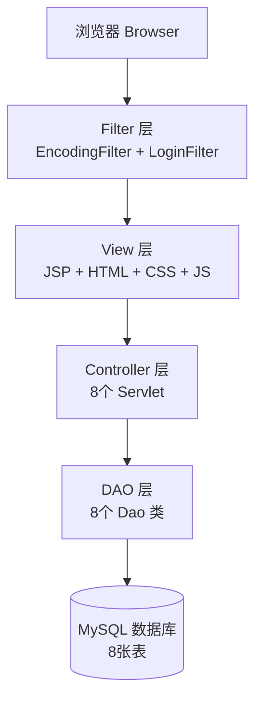
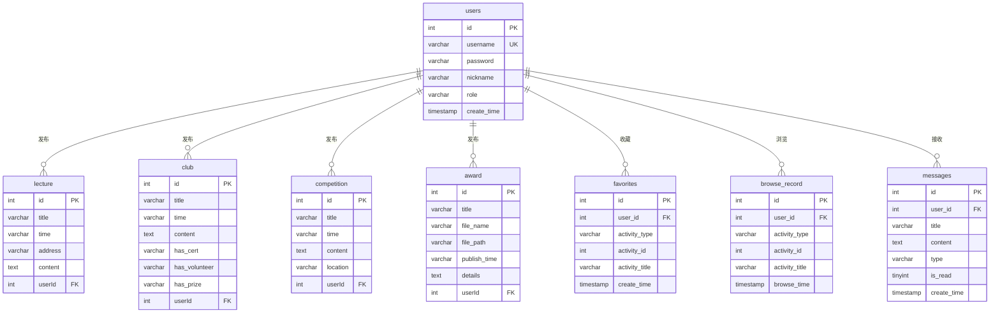

# 🏫 校园活动综合管理系统 CampusActivitySystem

> 基于 Java Servlet + JSP + JDBC + MySQL 的校园活动一站式管理平台  
> 课程实训项目 | 已部署阿里云，公网可访问

[](https://www.oracle.com/java/)
[](https://javaee.github.io/servlet-spec/)
[](https://www.mysql.com/)
[](https://tomcat.apache.org/)
[](LICENSE)

---

## 📖 项目简介

校园活动综合管理系统是一款面向高校的 Web 应用，为 **管理员**、**社团负责人**、**普通学生** 三类用户提供统一的活动管理入口。系统基于 **RBAC（基于角色的访问控制）** 实现 Admin / Leader / User 三级权限管控，覆盖 **讲座、社团活动、竞赛、评优** 四大核心业务场景，支持活动发布管理、收藏、浏览记录留存、评优附件上传下载、站内消息通知等完整功能。

### 核心亮点

- 🔐 **三级 RBAC 权限** — 管理员全平台管理、负责人自主维护、普通用户浏览交互
- 📋 **四大活动模块** — 讲座 / 社团活动 / 竞赛 / 评优，完整 CRUD 操作
- 📎 **评优附件管理** — 文件落地服务器 + 数据库存路径，优化存储与读写效率
- ⭐ **活动收藏** — 用户收藏感兴趣的活动，支持一键取消
- 👀 **浏览记录** — 自动记录浏览轨迹，支持清空历史
- 📬 **站内消息** — 新活动发布自动通知所有用户，支持已读/未读标记
- 🔒 **安全设计** — SHA-256 + 固定盐值密码摘要，登录拦截过滤器

### 线上演示

> 🔗 **公网地址**：[http://120.77.178.130:8233/CampusActivitySystem/login](http://120.77.178.130:8233/CampusActivitySystem/login)  
> 测试账号：`admin` / `123456`（管理员）、`leader` / `123456`（负责人）

---

## 🛠 技术栈

| 层级 | 技术 |
|:---|:---|
| **后端** | Java 8, Servlet 4.0, JDBC |
| **前端** | JSP, JSTL, HTML5, CSS3, JavaScript |
| **数据库** | MySQL 8.0（utf8mb4） |
| **构建工具** | Maven |
| **服务器** | Apache Tomcat 9.0 |
| **安全** | SHA-256 密码摘要 + Session 认证 |
| **文件上传** | Apache Commons FileUpload |
| **部署平台** | 阿里云 ECS + Tomcat 8.5 |

---

## 📁 项目结构

```
CampusActivitySystem/
├── sql/
│   └── init.sql                          # 数据库初始化脚本（8张表 + 默认数据）
├── src/main/java/com/
│   ├── entity/                           # 实体类（8个）
│   │   ├── User.java                     # 用户实体
│   │   ├── Lecture.java                  # 讲座实体
│   │   ├── Club.java                     # 社团活动实体
│   │   ├── Competition.java              # 竞赛实体
│   │   ├── Award.java                    # 评优实体
│   │   ├── Favorite.java                 # 收藏实体
│   │   ├── BrowseRecord.java             # 浏览记录实体
│   │   └── Message.java                  # 消息实体
│   ├── dao/                              # 数据访问层（8个）
│   │   ├── UserDao.java                  # 用户 CRUD
│   │   ├── LectureDao.java               # 讲座 CRUD
│   │   ├── ClubDao.java                  # 社团活动 CRUD
│   │   ├── CompetitionDao.java           # 竞赛 CRUD
│   │   ├── AwardDao.java                 # 评优 CRUD
│   │   ├── FavoriteDao.java              # 收藏增删查
│   │   ├── BrowseRecordDao.java          # 浏览记录管理
│   │   └── MessageDao.java               # 消息管理 + 批量通知
│   ├── servlet/                          # 控制层（8个）
│   │   ├── LoginServlet.java             # 用户登录
│   │   ├── RegisterServlet.java          # 用户注册
│   │   ├── LogoutServlet.java            # 退出登录
│   │   ├── LectureServlet.java           # 讲座管理（list/add/edit/delete）
│   │   ├── ClubServlet.java              # 社团活动管理
│   │   ├── CompetitionServlet.java       # 竞赛管理（@WebServlet）
│   │   ├── AwardServlet.java             # 评优管理 + 文件上传（@WebServlet）
│   │   ├── DownloadServlet.java          # 附件下载（@WebServlet）
│   │   └── UserCenterServlet.java        # 用户中心
│   ├── filter/                           # 过滤器（2个）
│   │   ├── EncodingFilter.java           # 全局 UTF-8 编码过滤器
│   │   └── LoginFilter.java              # 登录拦截过滤器
│   └── utils/                            # 工具类（4个）
│       ├── DBUtil.java                   # JDBC 连接工具
│       ├── PasswordUtil.java             # SHA-256 密码工具
│       ├── RoleUtil.java                 # 角色权限判断
│       └── ActivityBrowseUtil.java       # 浏览记录 + 消息通知辅助
├── src/main/webapp/
│   ├── index.jsp                         # 首页
│   ├── header.jsp                        # 公共头部导航栏
│   ├── login.jsp                         # 登录页
│   ├── register.jsp                      # 注册页
│   ├── lecture.jsp                       # 讲座列表页
│   ├── club.jsp                          # 社团活动列表页
│   ├── competition.jsp                   # 竞赛列表页
│   ├── award.jsp                         # 评优列表页
│   ├── addLecture.jsp / addClub.jsp      # 新增活动页
│   ├── addCompetition.jsp / addAward.jsp # 新增活动页
│   ├── editLecture.jsp / editClub.jsp    # 编辑活动页
│   ├── editCompetition.jsp / editAward.jsp # 编辑活动页
│   ├── userCenter.jsp                    # 用户中心（多Tab）
│   ├── css/                              # 样式文件（4个）
│   │   ├── common.css                    # 通用样式
│   │   ├── manage.css                    # 管理页样式
│   │   ├── auth.css                      # 登录/注册样式
│   │   └── user-center.css               # 用户中心样式
│   └── WEB-INF/
│       └── web.xml                       # Web 部署描述符
└── pom.xml                               # Maven 配置
```

---

## 🏗 系统架构

采用经典 **MVC 三层架构**，纯手工实现，无 Spring 等重型框架：



---

## 💾 数据库设计

数据库名：`campus_activity` | 字符集：`utf8mb4` | 共 **8 张表**



| 表名 | 说明 | 核心字段 |
|:---|:---|:---|
| `users` | 系统用户 | id, username, password(SHA-256), nickname, role(admin/leader/user) |
| `lecture` | 讲座信息 | id, title, time, address, content, userId |
| `club` | 社团活动 | id, title, time, content, has_cert, has_volunteer, has_prize, userId |
| `competition` | 竞赛信息 | id, title, time, content, location, userId |
| `award` | 评优信息 | id, title, file_name, file_path, publish_time, details, userId |
| `favorites` | 用户收藏 | id, user_id, activity_type, activity_id, activity_title（联合唯一键） |
| `browse_record` | 浏览记录 | id, user_id, activity_type, activity_id, activity_title, browse_time |
| `messages` | 站内消息 | id, user_id, title, content, type, is_read, create_time |

### 默认账号数据

| 用户名 | 密码 | 角色 | 权限说明 |
|:---|:---|:---|:---|
| `admin` | `123456` | admin | 全平台管理权限，可增删改查所有用户发布的活动 |
| `leader` | `123456` | leader | 可发布活动，但仅能编辑/删除自己创建的活动 |

---

## ✨ 功能详情

### 1. 用户认证与权限（RBAC 三级）

| 角色 | 权限范围 |
|:---|:---|
| **Admin（管理员）** | 全平台管理，可编辑/删除任意用户发布的活动数据 |
| **Leader（负责人）** | 可发布活动，仅能编辑/删除本人创建的活动 |
| **User（普通用户）** | 浏览活动、收藏、查看浏览记录、接收站内消息 |

- ✅ 注册：用户名 3~50 字符，密码 ≥ 6 位，SHA-256 + 固定盐值摘要入库
- ✅ 登录：Session 存储不含密码的用户安全副本
- ✅ 全局拦截：`LoginFilter` 拦截未登录请求，自动跳转登录页
- ✅ 退出登录：Session 销毁，安全退出

### 2. 四大活动模块

| 模块 | 核心功能 | 特色 |
|:---|:---|:---|
| 📚 **讲座** | 新增 / 编辑 / 删除 / 列表查看 | 讲座时间、地点、内容详情 |
| 🎭 **社团活动** | 新增 / 编辑 / 删除 / 列表查看 | 支持标记是否颁发证书、志愿时长、评优获奖 |
| 🏆 **竞赛** | 新增 / 编辑 / 删除 / 列表查看 | 竞赛名称、时间、地点、详情 |
| 🎖 **评优** | 新增 / 编辑 / 删除 / 列表查看 | **支持附件上传/下载**（Commons FileUpload + UUID 重命名） |

### 3. 用户交互功能

| 功能 | 描述 |
|:---|:---|
| ⭐ **活动收藏** | 收藏/取消收藏活动，支持去重（联合唯一键），用户中心查看收藏列表 |
| 👀 **浏览记录** | 自动记录活动浏览轨迹（同一用户同一活动仅保留最新一条），支持清空历史 |
| 📬 **站内消息** | 注册欢迎消息 + 新活动发布自动通知，单条/全部标记已读，Header 导航栏未读角标 |

### 4. 安全设计

- 🔐 密码使用 **SHA-256 + 固定盐值** 摘要存储，从不存储明文
- 🛡️ 登录拦截 Filter 实现全局认证保护
- 🔑 Session 机制管理用户登录状态
- 📝 注册用户名唯一性校验

---

## 🚀 本地部署

### 环境要求

| 组件 | 版本 |
|:---|:---|
| JDK | 8 或更高 |
| Apache Tomcat | 8.5 / 9.0 |
| MySQL | 8.0 |
| IDE | Eclipse / IntelliJ IDEA |
| 浏览器 | Chrome / Edge / Firefox |

### 部署步骤

#### 1. 克隆仓库

```bash
git clone https://github.com/ppptatoo/CampusActivitySystem.git
```

#### 2. 创建数据库

使用 MySQL 客户端执行 `sql/init.sql` 脚本：

```bash
mysql -u root -p < sql/init.sql
```

该脚本会自动创建 `campus_activity` 数据库、全部 8 张数据表，并插入默认管理员和负责人账号。

#### 3. 配置数据库连接

修改 `src/main/java/com/utils/DBUtil.java` 中的连接信息：

```java
private static final String URL = "jdbc:mysql://localhost:3306/campus_activity"
        + "?useSSL=false&serverTimezone=Asia/Shanghai&characterEncoding=utf8"
        + "&allowPublicKeyRetrieval=true";

private static final String USER = "root";        // 改为你的 MySQL 用户名
private static final String PASSWORD = "your_pwd"; // 改为你的 MySQL 密码
```

#### 4. 添加依赖 JAR

确保 `WEB-INF/lib/` 目录包含以下 JAR 包：
- `mysql-connector-java-8.x.x.jar` — MySQL JDBC 驱动
- `commons-fileupload-1.4.jar` — 文件上传组件
- `commons-io-2.11.0.jar` — IO 工具
- `jstl.jar` / `standard.jar` — JSTL 标签库

#### 5. 配置 Tomcat 并启动

在 IDE 中配置 Tomcat 9.0，部署项目后启动。浏览器访问：

```
http://localhost:8080/CampusActivitySystem/login
```

#### 6. 登录测试

| 账号 | 密码 | 角色 |
|:---|:---|:---|
| `admin` | `123456` | 管理员 |
| `leader` | `123456` | 负责人 |

普通用户请自行通过注册页面注册。

---

## 🔧 配置说明

| 配置项 | 位置 | 说明 |
|:---|:---|:---|
| 数据库连接 | `com/utils/DBUtil.java` | URL / 用户名 / 密码 |
| 密码盐值 | `com/utils/PasswordUtil.java` | `APP_SALT` 常量，修改后旧密码将失效 |
| 文件上传路径 | `com/servlet/AwardServlet.java` | 默认上传到 `/upload/` 目录 |
| Servlet 映射 | `web.xml` + `@WebServlet` 注解 | 部分 Servlet 使用注解注册 |

---

## 🗺 后续优化展望

- [ ] 前端 UI 现代化升级，引入响应式设计
- [ ] 基于用户浏览和收藏数据实现活动个性化推荐
- [ ] 新增后台数据可视化统计面板（活动热度、用户活跃度等）
- [ ] 引入数据库连接池（如 Druid / HikariCP）提升性能
- [ ] 迁移至 Spring Boot + MyBatis 技术栈
- [ ] 增加 RESTful API，支持前后端分离
- [ ] 增加单元测试与集成测试

---

## 📄 许可证

本项目仅供学习交流使用。

